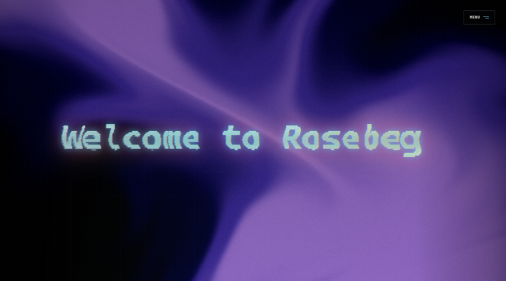
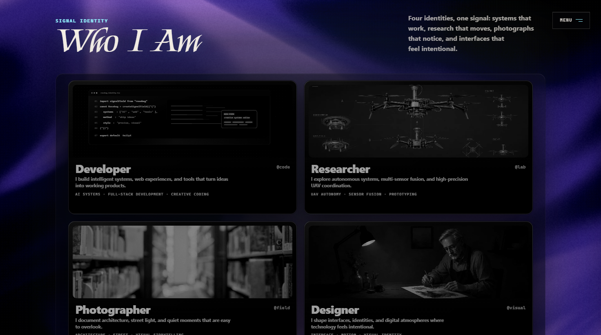
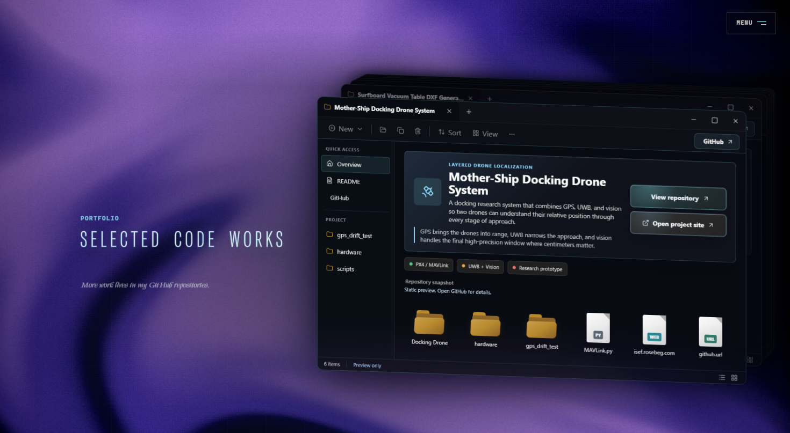
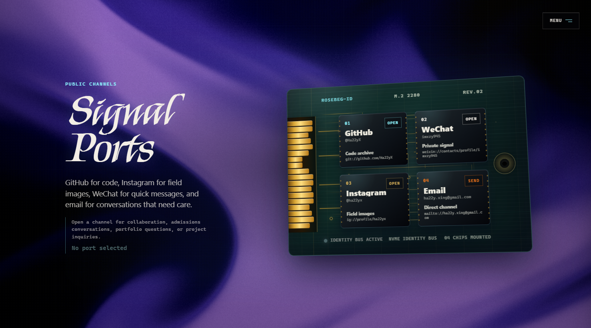

# Rosebeg

Rosebeg is my self-designed personal brand and introduction website.

Live case: [harry.rosebeg.com](https://harry.rosebeg.com/)

It introduces who I am, what I build, and how my work connects across software,
robotics research, photography, and interface design. The site is built as a
single-page visual portfolio with React, TypeScript, Tailwind CSS, Framer
Motion, Three.js ASCII text, and a shader-based background system.

## Preview

### Opening screen



### Identity section



### Selected code works



### Signal ports



## What the Site Presents

- A personal introduction for Zhiyuan Xing / HarryX.
- Selected software, research, and creative projects.
- A visual identity for Rosebeg as a personal brand.
- Photography and field-image work.
- Public contact channels and project links.

## Tech Stack

- React 19
- TypeScript
- Vite
- Tailwind CSS 4
- Framer Motion
- Three.js / React Three Fiber
- GSAP
- Playwright

## Local Development

```bash
npm install
npm run dev
```

Open the local URL printed by Vite.

## Verification

```bash
npm run build
npm test
```

## Repository Guide

- `src/App.tsx` - homepage content, links, and section structure.
- `src/styles.css` - visual system, layout, and responsive behavior.
- `src/components/ShaderBackground.tsx` - global shader background.
- `components/ui/manifesto-typewriter.tsx` - Rosebeg title sequence.
- `components/ui/ascii-text.tsx` - ASCII text renderer.
- `components/ui/signal-navigation.tsx` - navigation menu.
- `public/project-card-swap/` - embedded selected works interface.
- `docs/readme/` - README screenshots.

